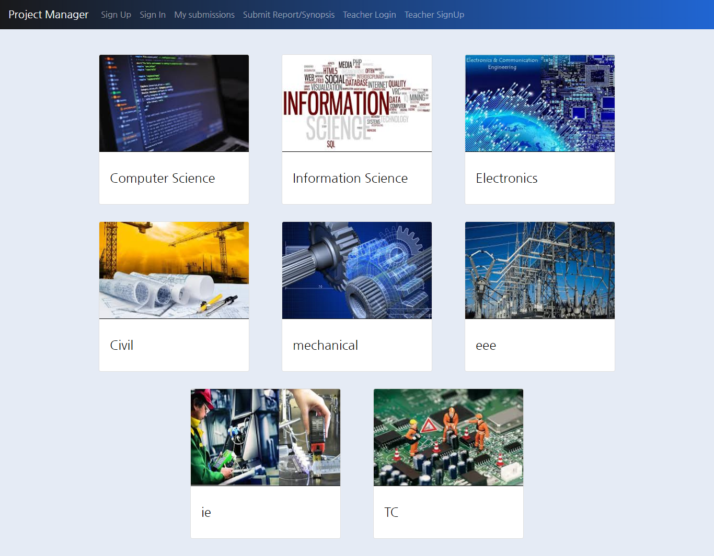
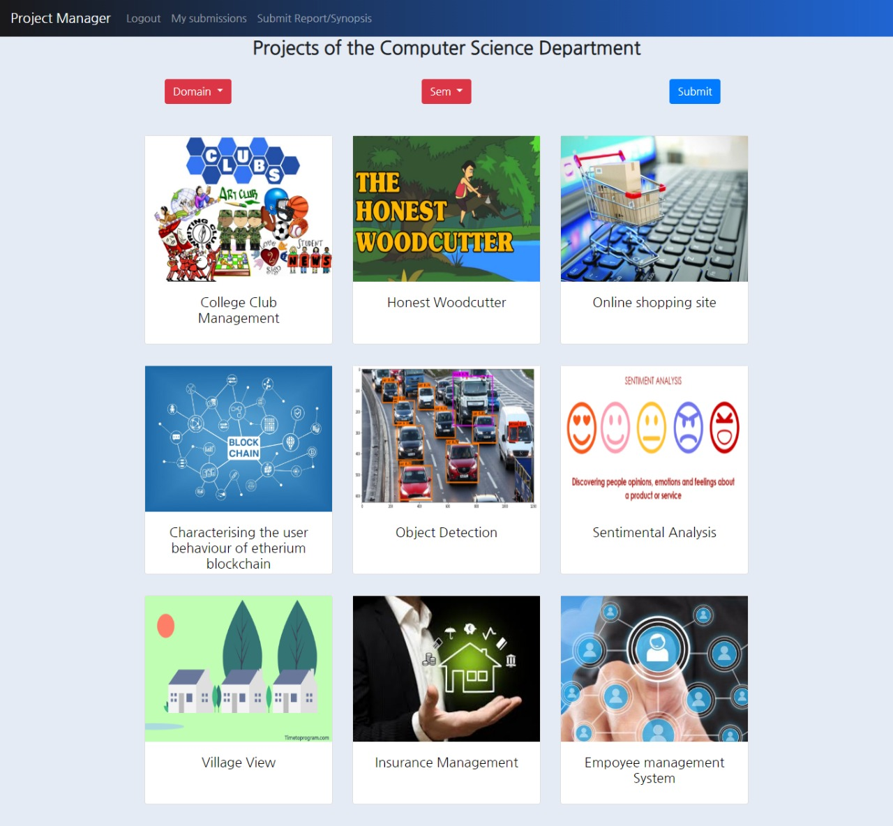
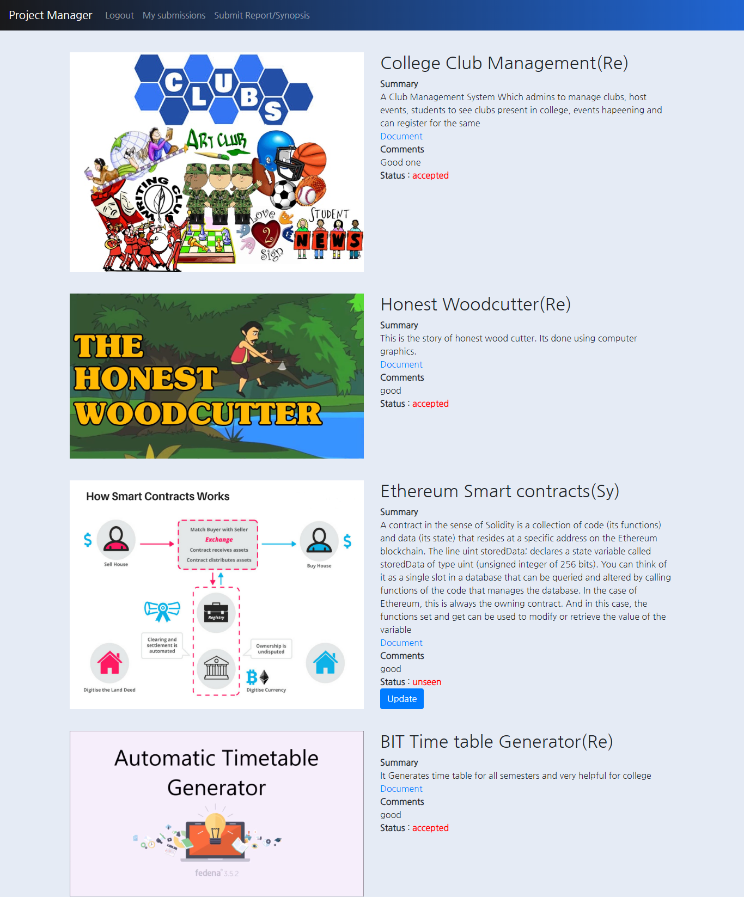

# Project_Manager
A web application that lets students to view projects, submit synopsis/report to teacher and can be reviewed by them as well. 
This helps the other students get inspired by student projects and build new projects or develop better version of existing students.

**Key Technologies**
* Django
* Python
* SQlite
* HTML,CSS,Bootstrap 4

The flow of the project as follows
<b>Home Page</b>

 

**Projects List**

**Individual Project**

 

**Student Dashboard**

 

**List of Project reports/synopsis submitted to Teacher**

**Individual Project for teacher's viewing**

